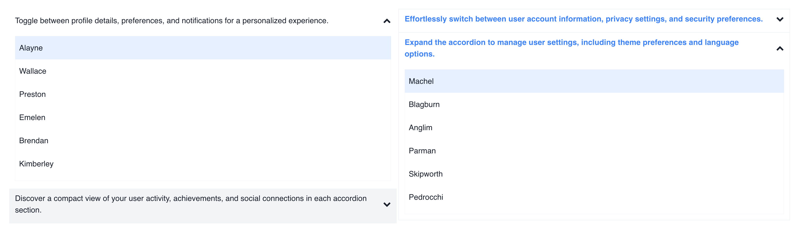
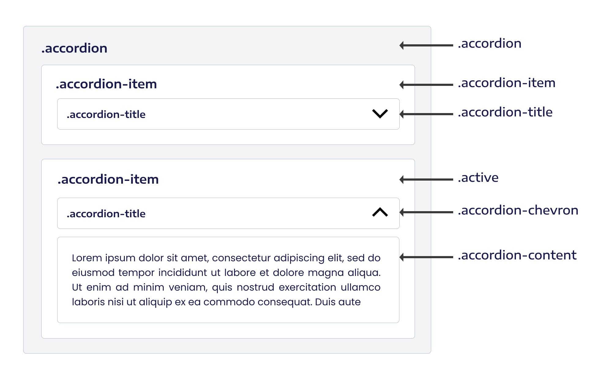
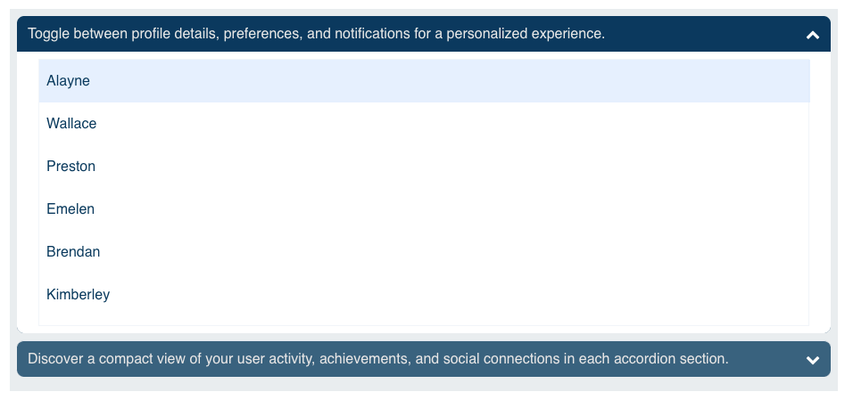

# Overview

** Accordion component for Qodly apps**



## Properties

| Name               | Type           | Default                                   | Description                                                                                                                    |
| ------------------ | -------------- | ----------------------------------------- | ------------------------------------------------------------------------------------------------------------------------------ |
| `Variant`          | String         | `Default`                                 | Accordion style. Choose from `Default`, `Contained`, `Filled` or `Separated`.                                                  |
| `Open Chevron`     | Icon           | `fa-chevron-up`                           | Icon displayed when the accordion is collapsed.                                                                                |
| `Close Chevron`    | Icon           | `fa-chevron-down`                         | Icon displayed when the accordion is open.                                                                                     |
| `Raduis`           | String         | `None`                                    | Raduis style. Choose from `None`, `Small`, `Medium`, `Large`, `Extra Large`, `Extra Extra Large` or `Extra Extra Extra Large`. |
| `Multiple`         | Boolean        | `False`                                   | If set to `true`, multiple accordions can be opened simultaneously.                                                            |
| `Chevron Position` | String         | `right`                                   | Position of the accordion items. Choose from `left` or `right`.                                                                |
| `Transition`       | String         | `300 ms`                                  | Transition duration. Choose from `0 ms`, `75 ms`, `100 ms`, `150 ms`, `200 ms`, `300 ms`, `500 ms`, `700 ms`, `1000 ms`.       |
| `Items`            | Accordion Item | Required; comes with one item by default. | Required to set accordion items; comes with one item by default.                                                               |

## Accordion Item

| Name    | Type   | Description                                         |
| ------- | ------ | --------------------------------------------------- |
| `Title` | String | The accordion Title, only necessary for properties. |

## Custom CSS

When customizing the appearance of the accordion, you have access to the following classes within the component:


Here's an example of how you can target the accordion component in your CSS:


```css
/* Custom styles for the accordion component */
self > .accordion {
  /* Add your custom styles here */
  padding: 0.5em;
  background: rgba(4, 57, 94, 0.1);
  /* ... */
}

/* Custom styles for accordion items */
self > .accordion .accordion-item {
  /* Add styles for each accordion item */
  margin-bottom: 8px;
  border-radius: 8px;
  overflow: hidden;
  background: rgba(4, 57, 94, 0.8);
  /* ... */
}

/* Custom styles for accordion open items on hover */
self > .accordion .accordion-item:hover {
  /* Add styles for each accordion open item on hover */
  background: rgba(4, 57, 94, 1);
  /* ... */
}

/* Custom styles for accordion open items */
self > .accordion .accordion-item.active {
  /* Add styles for each accordion open item */
  background: rgba(4, 57, 94, 1);
  /* ... */
}

/* Custom styles for accordion titles */
self > .accordion .accordion-item .accordion-title {
  /* Add styles for each accordion title */
  color: #e7e7e7;
  /* ... */
}

/* Custom styles for accordion chevrons */
self > .accordion .accordion-item .accordion-title .accordion-chevron {
  /* Add styles for each accordion item */
  color: white;
  /* ... */
}

/* Custom styles for accordion content */
self > .accordion .accordion-item .accordion-content {
  /* Add styles for each accordion content */
  padding: 0 16px;
  background: white;
  color: rgba(4, 57, 94, 1);
  /* ... */
}
```
